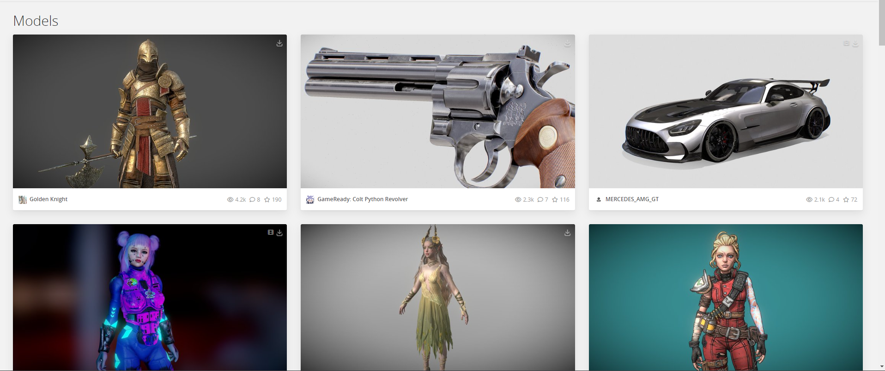
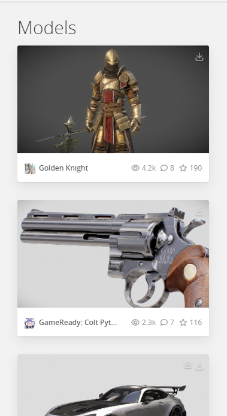

# Description

We need to design a product card that features a 3D object and provides an interactive experience for the user. The design should include a hover effect that causes the object to rotate, allowing the viewer to see it from multiple angles.

# General Requirements

- [Next.js w/ TypeScript](https://nextjs.org/docs/basic-features/typescript)
- [Tailwind CSS](https://tailwindcss.com/docs/guides/nextjs)
- [React Three Fiber](https://docs.pmnd.rs/react-three-fiber/getting-started/introduction)

# Reference Videos

### [Loading GLTF Models](https://www.youtube.com/watch?v=ARW_EiH6HH0&t=1s)

# Example Images

## Desktop



## Mobile



# Instructions if needed

# [Create Next App w/ TypeScript](https://nextjs.org/docs/getting-started)

```bash
yarn create next-app my-project --typescript --eslint
```

# [Install Tailwind CSS](https://tailwindcss.com/docs/guides/nextjs)

```bash
yarn add -D tailwindcss postcss autoprefixer
```

```bash
yarn tailwindcss init -p
```

## Configure template path

Add the paths to all of your template files in your tailwind.config.js file.

```javaScript
/** @type {import('tailwindcss').Config} */
module.exports = {
  content: [
    "./app/**/*.{js,ts,jsx,tsx}",
    "./pages/**/*.{js,ts,jsx,tsx}",
    "./components/**/*.{js,ts,jsx,tsx}",

    // Or if using `src` directory:
    "./src/**/*.{js,ts,jsx,tsx}",
  ],
  theme: {
    extend: {},
  },
  plugins: [],
}
```

## Add the Tailwind directives to your CSS

Add the @tailwind directives for each Tailwind’s layers to your globals.css file.

```css
@tailwind base;
@tailwind components;
@tailwind utilities;
```

# [Install React Three Fiber & Drei](https://docs.pmnd.rs/react-three-fiber/getting-started/introduction)

```bash
yarn add three @types/three @react-three/fiber
```

```bash
yarn add @react-three/drei
```
